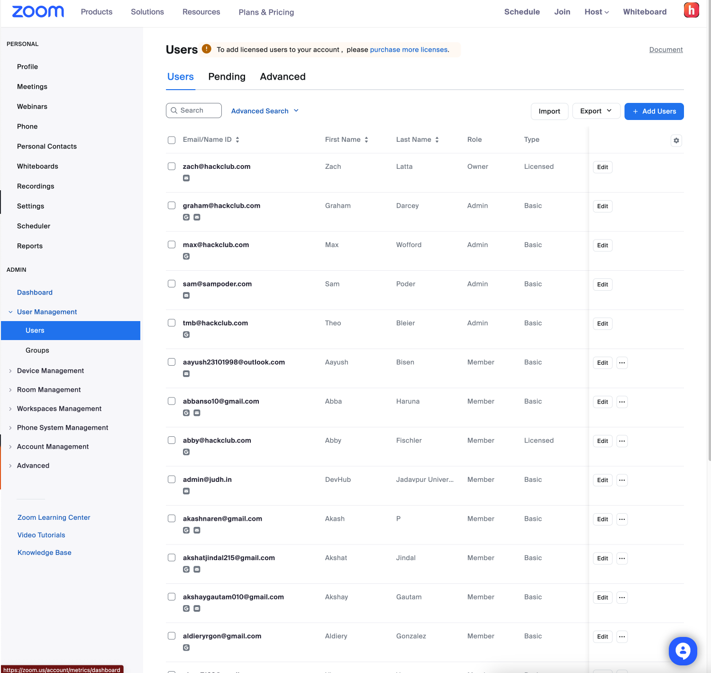

Prerequisite: You must be a Zoom administrator

1) Login to zoom and navigate to the **Users Management** tab

2) Select the **Purchase more licenses** link.

3) Select **Edit Plan**

4) Increment the **Number of users** to the desired (increased) number of users.

5) Enter the requisite information that Zoom prompts you to provide.  When asked for the email address, please use the precedent used for all of the other accounts (i.e. logins+slash-z-command-{NUMBER}@hackclub.com)

6) You will eventually be prompted to enter in the CVV of the credit card associated with the Zoom administrator account.  Reach out to graham@hackclub.com or msw@hackclub.com for that information.

7) Login to logins@hackclub.com using 1password.  Zoom should have sent an email to this address with an account activation link.  Click that link.

8) Login to the Slash-Z Postgres database and add a new row to the **Hosts** table.  The only unique values that need to be entered specific to the new host are the "email" and "displayName" columns (the rest is common and can be retrieved from other entries).
