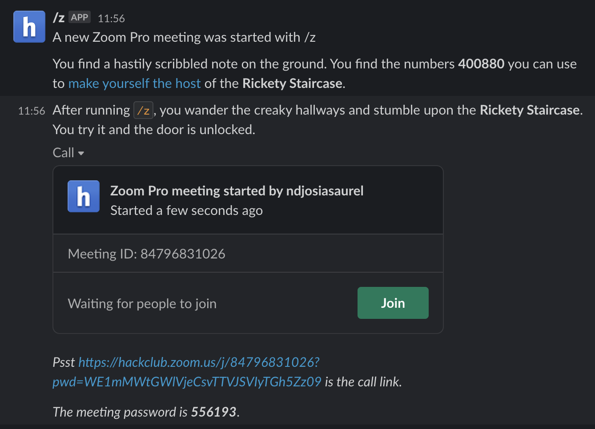
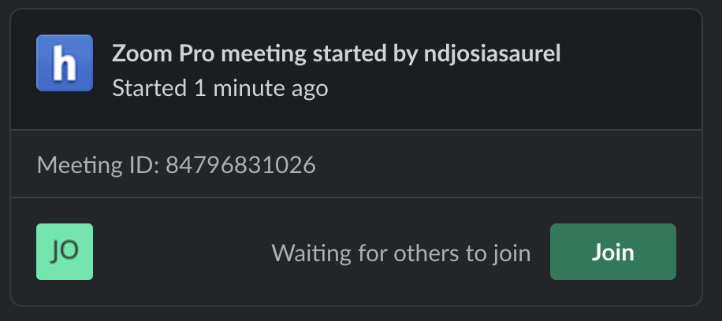

## How to test if slash-z runs properly

## Testing slack calls 

1. Run `/z` command in your DM
2. A new call should be created and will look like this 

3. Join the call by clicking the **Join** button
4. After joining the call, the call card should updated with your gravatar 
5. Next, leave the call and your gravatar should disappear from the call card

## Testing scheduled calls

1. Start a new call by sending a GET request to [https://js-slash-z.herokuapp.com/api/endpoints/new-schedule-link](https://js-slash-z.herokuapp.com/api/endpoints/new-schedule-link)
2. Get and copy the property value of `videoUri`
3. paste the link in a new tag and take note of the zoom call id
> given a call such as **https://hackclub.zoom.us/j/81651504037?pwd=YlE1ekFHckNhSm9GZDJtd2NZNnozQT09#success**, the zoom id is right after the /j path -- in this case **81651504037**
4. join the call 
5. you may allow an additional person to join your same call to prove that the call link works properly
6. wait for two minutes while in the call
7. leave the call with your testing partner if any
8. If anything wrong happens, refer to [runbook] to investigate what went wrong

## Testing the garbage collector 

1. Create a new call using /z in Slack and take note of the Meeting ID
2. Join the call and wait for ~2 minutes
3. Run `python3 scripts/zstory.py dissect -z <MeetingID>` to ensure the meeting has not been marked as ended
    - If it has been while you're still in the call, then start looking into closeZoomCall.js/closeStaleCalls.js to make sure calls are not forcibly closed under wrong conditions.
4. If not, leave the call and run the command from (3) again to make sure the call has been closed.
5. If the call was closed almost immediately after you left, then the garbage collector works properly.

